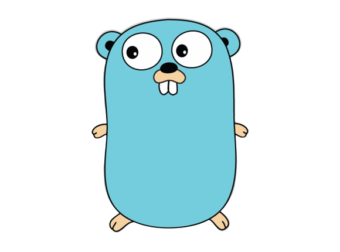

<div align="center">

## Web Service in GO



&emsp;


</div>

## Steps to run

1. Create `.env` file based on `env.example` file.

2. First, start the Postgres(latest version) service with following command.

```
make dev
```

3. To run the project build the project using following command

```
go build
```

4. Now, run the executable created with following command

```
./lets-go
```

5. To stop the postgres container from running.

```
make stop
```

#### Without database connection : [See Here](https://github.com/0xmatriksh/lets-go/tree/88ef82436ce614de6d2c107c58612d4d99dcd512)

### Some Possible FAQs

- What is the `go.mod` and `go.sum` file in the project?

  Ans: The go.mod file is to keep track of all the dependencies that are used in the project. And go.sum file contains the expected cryptographic checksums of the content of specific module versions.

- Why do we need mux for handling routing, cannot we do with `http.handleFunc()` itself?

  Ans: The point is with http we use `DefaultServeMux` and it can be accessed by any third party program too. So it won't be safe in terms of security. And when we use mux from `gorilla/mux` for instance, ServeMux will be the one for our program. And apart from that there are other advantage like:

  - Middleware Support
  - Variable Path(variable in path)
  - Subrouter Support

- What is difference between \_ "libaray/path" and "library/path" in import?

  Ans: The _ infront of the module name is for **blank import** where it means the exported properties in the module cannot be used directly in the code. But if it is imported without "_" than we can use exported variable/function.

- What is pointers in Go?

  Ans: Check out this [Post](https://0xmatriksh.github.io/posts/pointers-in-go/) for the answer.

- How to utitlize the concurency in Go here in our web service?

  Ans: In Go, concurrency is an inherent feature of the language. And to leverage this feature we need to implement Goroutines in our program. But the thing is, if we use this awesome package `net/http`, it has built in support of handling for requests concurrently by implementing the Goroutines. The server will listen for incoming requests on the specified port and handle each request in its own Goroutine.

If there are any other queries, feel free to raise an issue.
